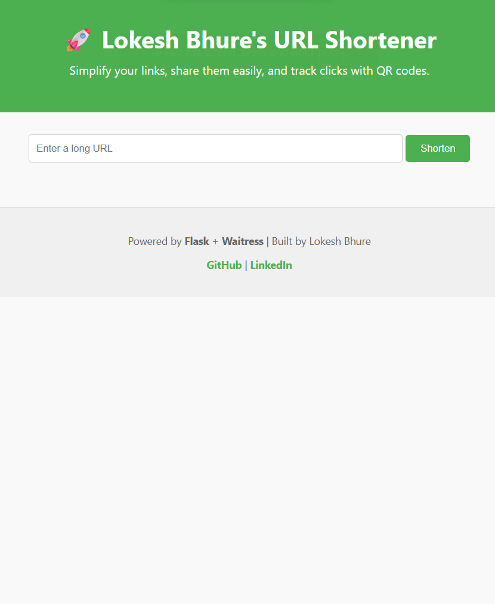
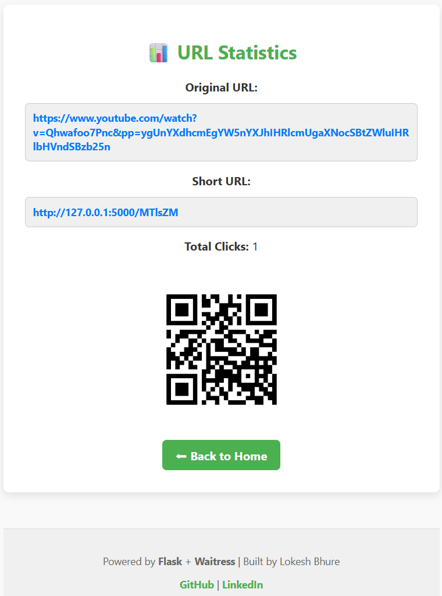

🚀  Lokesh's URL Shortener with QR Code & Analytics
---------------------------------------------------

A simple yet professional URL Shortener built using Flask, SQLite, and Waitress.
It converts long URLs into short, shareable links, generates QR codes, and tracks click analytics — perfect for portfolios, demos, and small internal tools.

🔗 Why This Project?
-------------------------------------------------------------------------

Long URLs are hard to share and look unprofessional, especially on social media, messages, or printed materials.
This project solves that by providing:

✅ Shortened URLs for easy sharing

✅ Auto-generated QR codes for mobile & offline access

✅ Click tracking to measure engagement

✅ Clean UI suitable for recruiter demos

✅ Production-ready setup using Waitress & Docker

🧠 Tech Stack
-------------------------------------------------------------------------

| Technology       | Purpose                                  |
| ---------------- | ---------------------------------------- |
| Flask            | Web framework for routing & server logic |
| Flask-SQLAlchemy | ORM for database handling                |
| SQLite           | Lightweight database for URLs            |
| qrcode           | Generate QR codes for each short URL     |
| Waitress         | Production-grade WSGI server             |
| HTML & CSS       | Frontend UI                              |
| Docker           | Containerized deployment                 |

📁 Project Structure
-------------------------------------------------------------------------

```
URL_SHORTENER/
├── app.py               # Flask app (development mode)
├── run_server.py        # Production server using Waitress
├── models.py            # Database models
├── cleanup.py           # Deletes generated QR codes
├── requirements.txt     # Python dependencies
├── Dockerfile           # Docker configuration
├── templates/
│   ├── index.html       # Home page (URL input & result)
│   ├── stats.html       # Analytics page
│   └── README.md
├── screenshots/
│   └── homepahe.pgn        
│   └── result_1.png
│   └── result_2.png
│   └── stats.png           
├── static/
│   └── style.css        # UI styling
├── instance/
│   └── urls.db          # SQLite database (auto-created)
├── .gitignore

```
🛠️ Setup Instructions
---------------------------------------------------
1. Clone the Repository
   ```
   git clone https://github.com/lokeshbhure011/url_shortener.git
   cd url_shortener
   ```
2. Create a Virtual Environment
   ```
   python -m venv venv
   source venv/bin/activate  # On Windows: venv\Scripts\activate
   ```
3. Install Dependencies
   ```
   pip install -r requirements.txt
   ```
4. Initialize the Database
   ```
   python app.py
   ```
On first run, this will:

 -> Create urls.db inside instance/

 -> Launch the app at ```http://127.0.0.1:5000```

 -> Open your browser automatically

 -> Print a friendly startup message

🧪 Development Mode
---------------------------------------------------

Use ```app.py``` for testing and debugging:

```
python app.py
```
Features:

 -> Auto-reload on code changes

 -> QR codes saved in static/

 -> Console logs with custom messages

 🚀 Production Mode
 --------------------------------------------------
Use ```run_server.py``` for clean deployment:

```
python run_server.py
```
Benefits:

 -> Runs on Waitress (no duplicate logs or warnings)

 -> Opens browser automatically

 -> Ideal for demos and local hosting

 🧼 Cleanup Script
 --------------------------------------------------
To delete all generated QR codes:
```
python cleanup.py
```
 -> This removes all .png files from the static/ folder.

 🖼️ Screenshots
 --------------------------------------------------
Homepage
-----------



Shortened link display & QR code preview
---------------------------------------------------


 -> URL input form

 -> Shortened link display

 -> QR code preview

 -> Stats link


Stats Page
---------------------------------------------------




 -> Original and short URL

 -> Total click count

 -> QR code

 -> Back to home button

  🔍 How It Works
 --------------------------------------------------
1. User submits a long URL
----------------------------

 -> Form in ```index.html``` sends POST request

 ->```app.py``` generates a random short key

2. URL is stored in SQLite
---------------------------------------------------

 -> ```models.py``` defines the ```URL``` model

 -> SQLAlchemy handles insertion

3. QR code is generated
---------------------------------------------------

 -> ```qrcode.make()``` creates image

 -> Saved to ```static/{short_key}.png```

4. Redirect logic
---------------------------------------------------
 -> Visiting ```/abc123``` redirects to original URL

 -> Click count is incremented

5. Stats 
---------------------------------------------------
 -> ```/stats/abc123`` shows:

 -> Original URL

 -> Short URL

 -> Total clicks

 -> QR code

 📦 Docker Deployment
 --------------------------------------------------
Build and run the container:
---------------------------------------------------

```
docker build -t url-shortener .
docker run -p 5000:5000 url-shortener 
```
 -> This uses ```Dockerfile``` to:

 -> Install dependencies

 -> Copy project files

 -> Expose port 5000

 -> Run the app via ```run.py```

📚 Real-World Use Cases
---------------------------------------------------
 -> Recruiter portfolios:
 --------------------------
  Showcase backend, frontend, and deployment skills

 -> Internal tools: 
 --------------------------------------------------
 Simplify links for teams or campaigns

 -> QR-based marketing:
 -------------------------------------------------
  Print QR codes for flyers, posters, or business cards

 -> Click tracking:
 ------------------------------------------------- 
 Monitor engagement on shared links


🧩 Module Breakdown
---------------------------------------------------
```app.py```

-> Core Flask logic

-> Handles form submission, QR generation, redirects, and stats

```run_server.py```

-> Clean production server using Waitress

-> Avoids Flask debug warnings

```models.py```
```
class URL(db.Model):
    id = db.Column(db.Integer, primary_key=True)
    original_url = db.Column(db.String(512))
    short_url = db.Column(db.String(10), unique=True)
    clicks = db.Column(db.Integer, default=0)
```
```cleanup.py```

-> Deletes all ```.png``` QR codes from ```static/```

```templates/index.html```

-> Form UI

-> Displays shortened link and QR code

```templates/stats.html```

-> Shows click stats and QR code

```static/style.css```

-> Custom styles for modern, recruiter-friendly UI


---------------------------------------------------


